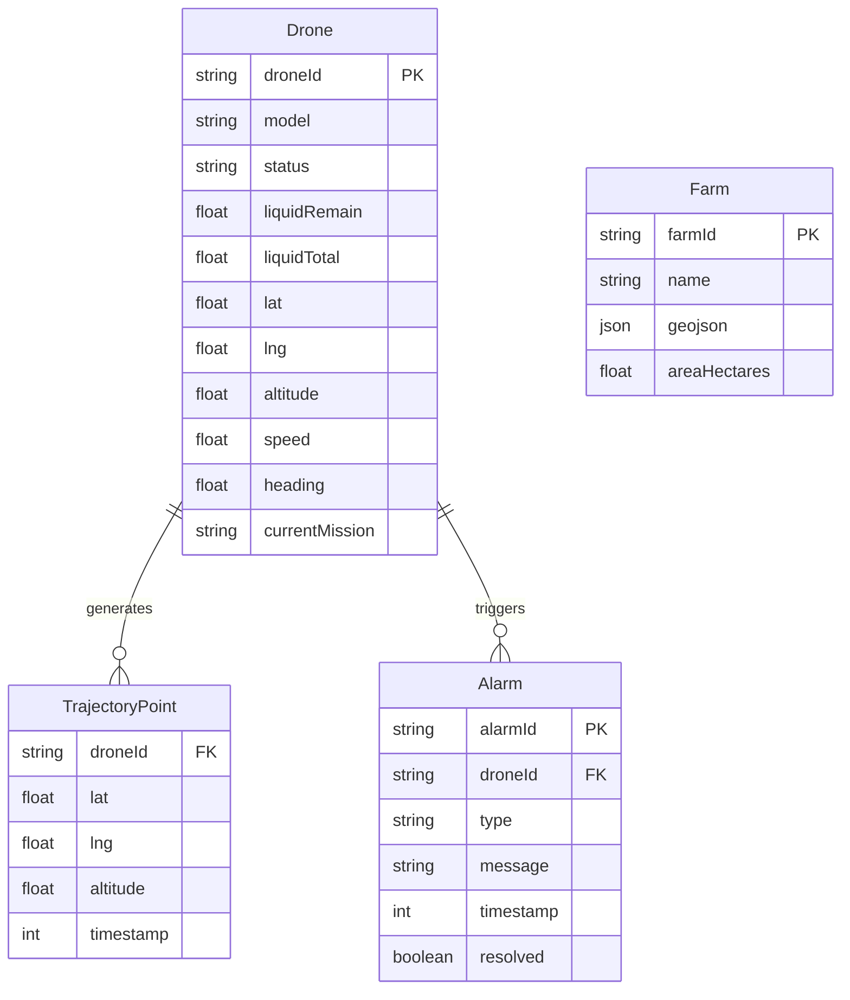

## 1. 架构设计

```mermaid
graph TB
    subgraph "硬件层"
        "D1~D50: 植保无人机"
    end
    subgraph "消息中间件"
        "EMQX Broker"
    end
    subgraph "后端服务 (NestJS)"
        "MQTT 客户端池"
        "遥测解析服务"
        "告警引擎"
        "WebSocket 网关"
        "REST API"
        "模拟数据服务"
    end
    subgraph "前端 (Vue3 + Vite)"
        "Leaflet 卫星底图"
        "GeoJSON 边界图层"
        "WebGL 航点/轨迹图层"
        "机群状态面板"
        "药量监控面板"
        "Pinia 状态管理"
    end

    "D1~D50: 植保无人机" -->|"MQTT telemetry/{droneId}"| "EMQX Broker"
    "EMQX Broker" -->|"订阅 telemetry/#"| "MQTT 客户端池"
    "MQTT 客户端池" -->|"原始报文"| "遥测解析服务"
    "遥测解析服务" -->|"结构化数据"| "告警引擎"
    "遥测解析服务" -->|"结构化数据"| "WebSocket 网关"
    "告警引擎" -->|"告警事件"| "WebSocket 网关"
    "WebSocket 网关" -->|"实时推送"| "Pinia 状态管理"
    "REST API" -->|"HTTP 请求"| "Pinia 状态管理"
    "Pinia 状态管理" -->|"响应式数据"| "Leaflet 卫星底图"
    "Pinia 状态管理" -->|"响应式数据"| "GeoJSON 边界图层"
    "Pinia 状态管理" -->|"响应式数据"| "WebGL 航点/轨迹图层"
    "Pinia 状态管理" -->|"响应式数据"| "机群状态面板"
    "Pinia 状态管理" -->|"响应式数据"| "药量监控面板"
    "模拟数据服务" -->|"模拟遥测"| "MQTT 客户端池"
```

## 2. 技术说明

- **前端**：Vue3@3 + TypeScript + Vite@5 + Tailwind CSS@3 + Leaflet@1 + PixiJS@7（WebGL 渲染层）
- **后端**：NestJS@10 + TypeScript + emqx（MQTT.js 客户端）+ @nestjs/websockets + @nestjs/platform-socket.io
- **消息中间件**：EMQX 5.x（MQTT Broker），后端内置模拟数据服务作为数据源
- **项目初始化工具**：vite-init（前端）、@nestjs/cli（后端）
- **数据库**：无（MVP 阶段使用内存数据，模拟遥测驱动）
- **包管理器**：npm

## 3. 路由定义

| 路由 | 用途 |
|------|------|
| `/` | 指挥大屏主页面（卫星底图 + 机群实时监控） |
| `/fleet` | 机群列表页面（无人机状态表格） |
| `/drone/:id` | 单架无人机作业详情页面 |

## 4. API 定义

### 4.1 WebSocket 事件

```typescript
interface DroneTelemetry {
  droneId: string
  lat: number
  lng: number
  altitude: number
  liquidRemain: number
  liquidTotal: number
  speed: number
  heading: number
  status: 'idle' | 'flying' | 'returning' | 'error'
  timestamp: number
}

interface FleetSummary {
  total: number
  online: number
  lowLiquid: number
  error: number
  totalArea: number
  coveredArea: number
}

interface AlarmEvent {
  droneId: string
  type: 'low_liquid' | 'offline' | 'geofence_breach' | 'altitude_warning'
  message: string
  timestamp: number
}

type WsServerEvents = {
  telemetry: (data: DroneTelemetry) => void
  fleet_summary: (data: FleetSummary) => void
  alarm: (data: AlarmEvent) => void
}
```

### 4.2 REST API

```typescript
interface FarmBoundary {
  id: string
  name: string
  geojson: GeoJSON.Polygon | GeoJSON.MultiPolygon
  areaHectares: number
}

interface DroneInfo {
  droneId: string
  model: string
  status: DroneTelemetry['status']
  currentMission: string | null
  totalFlights: number
  totalArea: number
}

type RestApi = {
  'GET /api/farms': FarmBoundary[]
  'GET /api/drones': DroneInfo[]
  'GET /api/drones/:id': DroneInfo
  'GET /api/drones/:id/trajectory': { points: [number, number][] }
}
```

## 5. 服务端架构图

```mermaid
graph LR
    subgraph "NestJS 应用"
        "TelemetryController" --> "TelemetryService"
        "DroneController" --> "DroneService"
        "FarmsController" --> "FarmsService"
        "TelemetryService" --> "MqttClientPool"
        "TelemetryService" --> "AlarmEngine"
        "TelemetryService" --> "WsGateway"
        "DroneService" --> "InMemoryStore"
        "FarmsService" --> "InMemoryStore"
        "SimulatorService" --> "MqttClientPool"
    end
```

## 6. 数据模型

### 6.1 数据模型定义



### 6.2 关键数据结构

MVP 阶段全部使用内存存储，关键数据结构定义在 `shared/types.ts` 中，前后端共享。

- **DroneState**：无人机当前状态，包含 GPS、药量、飞行参数，每 500ms 由遥测更新
- **TrajectoryBuffer**：每架无人机维护一个环形缓冲区（最近 2000 个点），用于轨迹渲染
- **FarmGeoJSON**：农场边界多边形，预置 3 个模拟农场
- **AlarmRecord**：告警记录，低药量阈值 <15%，离线超 10s 触发

## 7. 模拟数据策略

MVP 阶段不连接真实 EMQX，后端内置 `SimulatorService`：
- 生成 50 架虚拟无人机，初始位置分布在中国某大型农场区域内
- 每架无人机按预设航线（平行线扫掠模式）移动，模拟植保作业
- 每架无人机 500ms 上报一次遥测，药量按喷洒速率递减
- 达到药量阈值后自动返航，模拟换药后重新作业
- MQTT 报文格式与真实设备一致，便于后期无缝切换
